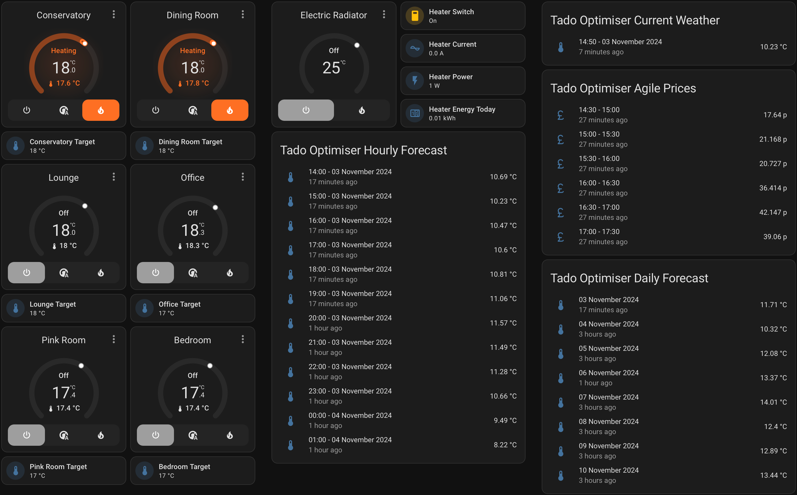
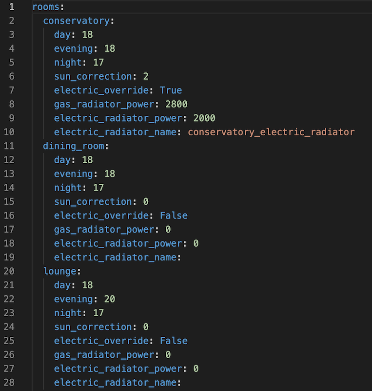

#  Tado Optimiser
## Tado Optimiser Add-on

In an attempt to learn how to "Code" and especially "Code"
an addon for Home Assistant, I came up with the idea to make my Tado system better.

I think Tado on its own is brilliant, and I am in no way saying that it's not.
I've just added a couple of features that help me in my situation.
If you think this may help you too, then feel free to install and help me test my coding.

To use Tado Optimiser, you need to have the following: -

- [ ] A Tado system set up and the Tado Integration in Home Assistant.
- [ ] An OpenWeather API 3.0 key. Available here https://openweathermap.org You will need to subscribe for a key. This is free and you'll get 10,000 calls per day. Make sure that when you get the key, you set the daily amount to 1000 or less to make sure.
- [ ] An Octopus account, and you know the API key and account number.
- [ ] If using an Electric Override device, it must be able to be controlled using the hvac climate feature in Home Assistant.

### My basic dashboard.



### The way my system works: -
- [ ] The logic runs every 10 minutes.
- [ ] The OpenWeather API is called, and all the Hourly & Daily Entities are created in Home Assistant.
- [ ] The Octopus API is called to find out your tariffs so the current Gas & Electricity price can be obtained. Entities are then created. In the illustration, I'm using Octopus Agile, but it should work with other tariffs.
- [ ] Each room in your house is then evaluated to see if it needs heat. Considerations are made to the future outside air temperature and the price of the current Gas & Electricity. If Electricity is cheaper any Electrical Override set up will be used instead of the Gas.  

### The Settings file



- [ ] Day is from Sunrise to Sunset.
- [ ] Evening is Sunset to Midnight.
- [ ] Night is everything else.
- [ ] Radiator power in watts.
- [ ] Temperatures in centigrade.

The settings file is located in the /addon_configs folder. It will be created on the first run.

### Home Assistant Entities

The YAML for the Weather Entities are as follows: -

### Current
```yaml
type: entities
entities:
  - entity: sensor.tado_optimiser_current
    secondary_info: last-updated
title: Tado Optimiser Current Weather
```
### Hourly
```yaml
type: entities
entities:
  - entity: sensor.tado_optimiser_hour_0
    secondary_info: last-updated
  - entity: sensor.tado_optimiser_hour_1
    secondary_info: last-updated
  - entity: sensor.tado_optimiser_hour_2
    secondary_info: last-updated
  - entity: sensor.tado_optimiser_hour_3
    secondary_info: last-updated
  - entity: sensor.tado_optimiser_hour_4
    secondary_info: last-updated
  - entity: sensor.tado_optimiser_hour_5
    secondary_info: last-updated
  - entity: sensor.tado_optimiser_hour_6
    secondary_info: last-updated
  - entity: sensor.tado_optimiser_hour_7
    secondary_info: last-updated
  - entity: sensor.tado_optimiser_hour_8
    secondary_info: last-updated
  - entity: sensor.tado_optimiser_hour_9
    secondary_info: last-updated
  - entity: sensor.tado_optimiser_hour_10
    secondary_info: last-updated
  - entity: sensor.tado_optimiser_hour_11
    secondary_info: last-updated
title: Tado Optimiser Hourly Forecast
show_header_toggle: false
state_color: false
```
### Daily
```yaml
type: entities
entities:
  - entity: sensor.tado_optimiser_day_0
    secondary_info: last-updated
  - entity: sensor.tado_optimiser_day_1
    secondary_info: last-updated
  - entity: sensor.tado_optimiser_day_2
    secondary_info: last-updated
  - entity: sensor.tado_optimiser_day_3
    secondary_info: last-updated
  - entity: sensor.tado_optimiser_day_4
    secondary_info: last-updated
  - entity: sensor.tado_optimiser_day_5
    secondary_info: last-updated
  - entity: sensor.tado_optimiser_day_6
    secondary_info: last-updated
  - entity: sensor.tado_optimiser_day_7
    secondary_info: last-updated
title: Tado Optimiser Daily Forecast
```
### 30 Minute Prices
```yaml
type: entities
entities:
  - entity: sensor.agile_electricity_price_0
    secondary_info: last-updated
  - entity: sensor.agile_electricity_price_30
    secondary_info: last-updated
  - entity: sensor.agile_electricity_price_60
    secondary_info: last-updated
  - entity: sensor.agile_electricity_price_90
    secondary_info: last-updated
  - entity: sensor.agile_electricity_price_120
    secondary_info: last-updated
  - entity: sensor.agile_electricity_price_150
    secondary_info: last-updated
title: Tado Optimiser Agile Prices
```
### Room Target Temperatures
```yaml
type: tile
entity: sensor.conservatory_target_temperature
layout_options:
  grid_columns: 2
  grid_rows: 1
```
